# Doffy Go Bootstrap - System Architecture

## Overview

Doffy Go Bootstrap is built on a layered, modular architecture that combines proven patterns from web frameworks like Fastify and NestJS. The system is designed around core principles of modularity, dependency injection, and encapsulation.

## High-Level Architecture

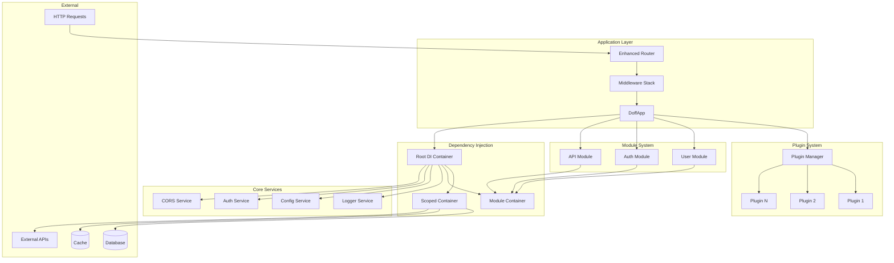
```mermaid
graph TB
    subgraph "Application Layer"
        App[DoffApp]
        Router[Enhanced Router]
        Middleware[Middleware Stack]
    end

    subgraph "Plugin System"
        PM[Plugin Manager]
        Plugin1[Plugin 1]
        Plugin2[Plugin 2]
        Plugin3[Plugin N]
    end

    subgraph "Module System"
        Module1[User Module]
        Module2[Auth Module]
        Module3[API Module]
    end

    subgraph "Dependency Injection"
        RootContainer[Root DI Container]
        ScopedContainer[Scoped Container]
        ModuleContainer[Module Container]
    end

    subgraph "Core Services"
        Logger[Logger Service]
        Config[Config Service]
        Auth[Auth Service]
        CORS[CORS Service]
    end

    subgraph "External"
        HTTP[HTTP Requests]
        DB[(Database)]
        Cache[(Cache)]
        API[External APIs]
    end

    HTTP --> Router
    Router --> Middleware
    Middleware --> App

    App --> PM
    PM --> Plugin1
    PM --> Plugin2
    PM --> Plugin3

    App --> Module1
    App --> Module2
    App --> Module3

    App --> RootContainer
    RootContainer --> ScopedContainer
    RootContainer --> ModuleContainer

    Module1 --> ModuleContainer
    Module2 --> ModuleContainer
    Module3 --> ModuleContainer

    ScopedContainer --> DB
    ScopedContainer --> Cache
    ScopedContainer --> API

    RootContainer --> Logger
    RootContainer --> Config
    RootContainer --> Auth
    RootContainer --> CORS
```

## Core Components Architecture

### 1. Application Architecture

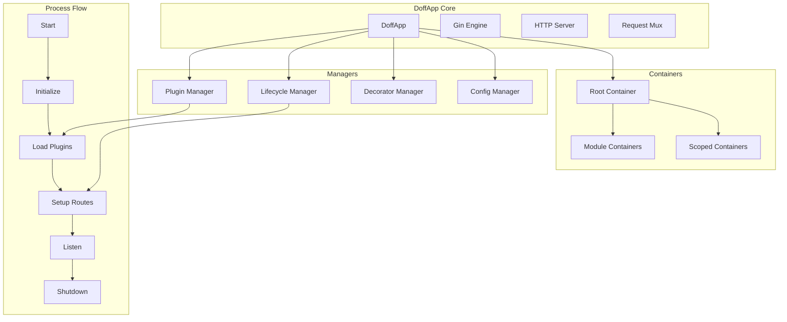
```mermaid
graph TB
    subgraph "DoffApp Core"
        App[DoffApp]
        Engine[Gin Engine]
        Server[HTTP Server]
        Mux[Request Mux]
    end

    subgraph "Managers"
        PM[Plugin Manager]
        LM[Lifecycle Manager]
        DM[Decorator Manager]
        CM[Config Manager]
    end

    subgraph "Containers"
        RC[Root Container]
        MCs[Module Containers]
        SC[Scoped Containers]
    end

    subgraph "Process Flow"
        Start[Start]
        Init[Initialize]
        Load[Load Plugins]
        Setup[Setup Routes]
        Listen[Listen]
        Shutdown[Shutdown]
    end

    Start --> Init
    Init --> Load
    Load --> Setup
    Setup --> Listen
    Listen --> Shutdown

    App --> PM
    App --> LM
    App --> DM
    App --> CM
    App --> RC

    PM --> Load
    LM --> Setup

    RC --> MCs
    RC --> SC
```

### 2. Dependency Injection Container Architecture

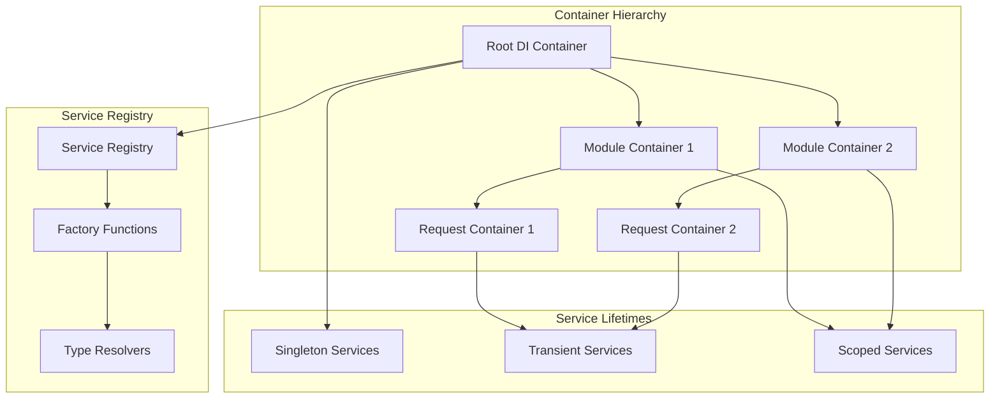
```mermaid
graph TB
    subgraph "Container Hierarchy"
        Root[Root DI Container]
        Module1[Module Container 1]
        Module2[Module Container 2]
        Request1[Request Container 1]
        Request2[Request Container 2]
    end

    subgraph "Service Lifetimes"
        Singleton[Singleton Services]
        Transient[Transient Services]
        Scoped[Scoped Services]
    end

    subgraph "Service Registry"
        Registry[Service Registry]
        Factories[Factory Functions]
        Resolvers[Type Resolvers]
    end

    Root --> Singleton
    Root --> Module1
    Root --> Module2

    Module1 --> Scoped
    Module2 --> Scoped
    Module1 --> Request1
    Module2 --> Request2

    Request1 --> Transient
    Request2 --> Transient

    Registry --> Factories
    Factories --> Resolvers
    Root --> Registry
```

### 3. Plugin System Architecture

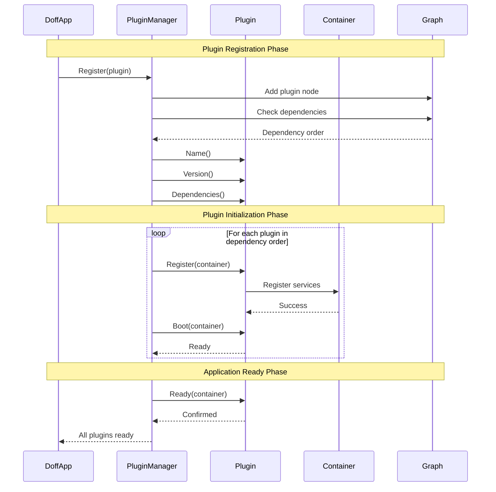
```mermaid
sequenceDiagram
    participant App as DoffApp
    participant PM as PluginManager
    participant P as Plugin
    participant C as Container
    participant G as Graph

    Note over App,G: Plugin Registration Phase

    App->>PM: Register(plugin)
    PM->>G: Add plugin node
    PM->>G: Check dependencies
    G-->>PM: Dependency order
    PM->>P: Name()
    PM->>P: Version()
    PM->>P: Dependencies()

    Note over App,G: Plugin Initialization Phase

    loop For each plugin in dependency order
        PM->>P: Register(container)
        P->>C: Register services
        C-->>P: Success
        PM->>P: Boot(container)
        P-->>PM: Ready
    end

    Note over App,G: Application Ready Phase

    PM->>P: Ready(container)
    P-->>PM: Confirmed
    PM-->>App: All plugins ready
```

### 4. Plugin Lifecycle Flow

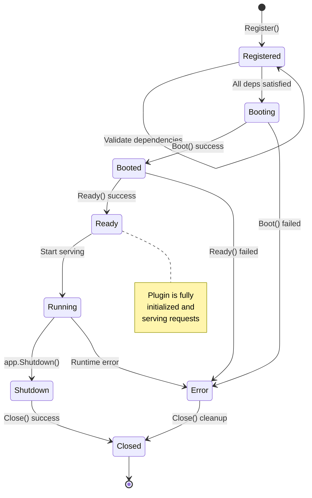
```mermaid
stateDiagram-v2
    [*] --> Registered: Register()
    Registered --> Registered: Validate dependencies
    Registered --> Booting: All deps satisfied

    Booting --> Booted: Boot() success
    Booting --> Error: Boot() failed
    Booted --> Ready: Ready() success
    Booted --> Error: Ready() failed
    Ready --> Running: Start serving

    Running --> Shutdown: app.Shutdown()
    Running --> Error: Runtime error

    Shutdown --> Closed: Close() success
    Error --> Closed: Close() cleanup
    Closed --> [*]

    note right of Ready
        Plugin is fully
        initialized and
        serving requests
    end note
```

### 5. Module System Architecture

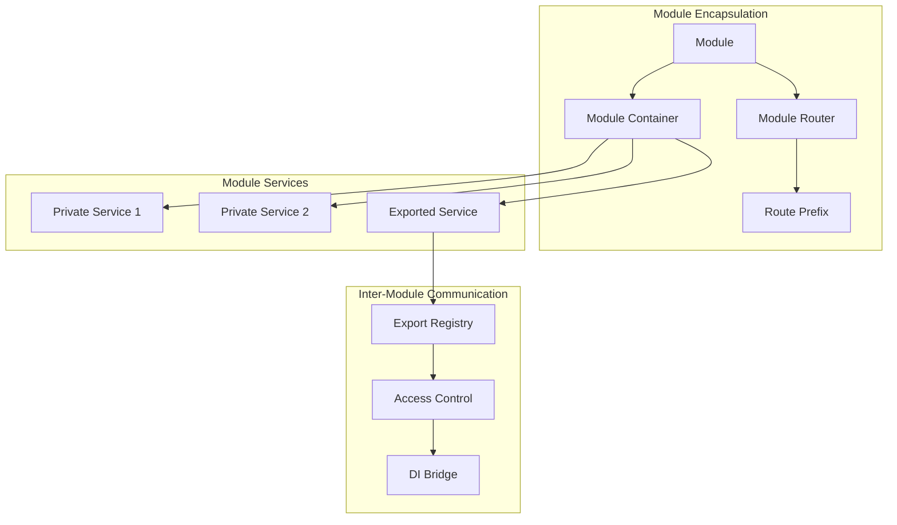
```mermaid
graph TB
    subgraph "Module Encapsulation"
        Module[Module]
        MContainer[Module Container]
        Router[Module Router]
        Prefix[Route Prefix]
    end

    subgraph "Module Services"
        Private1[Private Service 1]
        Private2[Private Service 2]
        Exported[Exported Service]
    end

    subgraph "Inter-Module Communication"
        ExportRegistry[Export Registry]
        AccessControl[Access Control]
        DependencyInjection[DI Bridge]
    end

    Module --> MContainer
    Module --> Router
    Router --> Prefix

    MContainer --> Private1
    MContainer --> Private2
    MContainer --> Exported

    Exported --> ExportRegistry
    ExportRegistry --> AccessControl
    AccessControl --> DependencyInjection
```

### 6. Request Processing Flow

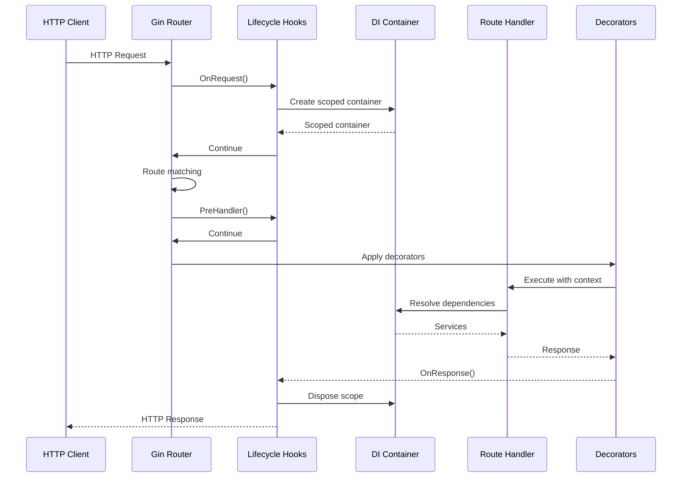
```mermaid
sequenceDiagram
    participant Client as HTTP Client
    participant Router as Gin Router
    participant Hooks as Lifecycle Hooks
    participant Container as DI Container
    participant Handler as Route Handler
    participant Decorators as Decorators

    Client->>Router: HTTP Request
    Router->>Hooks: OnRequest()

    Hooks->>Container: Create scoped container
    Container-->>Hooks: Scoped container

    Hooks->>Router: Continue
    Router->>Router: Route matching

    Router->>Hooks: PreHandler()
    Hooks->>Router: Continue

    Router->>Decorators: Apply decorators
    Decorators->>Handler: Execute with context

    Handler->>Container: Resolve dependencies
    Container-->>Handler: Services

    Handler-->>Decorators: Response
    Decorators-->>Hooks: OnResponse()

    Hooks->>Container: Dispose scope
    Hooks-->>Client: HTTP Response
```

### 7. Decorator System Architecture

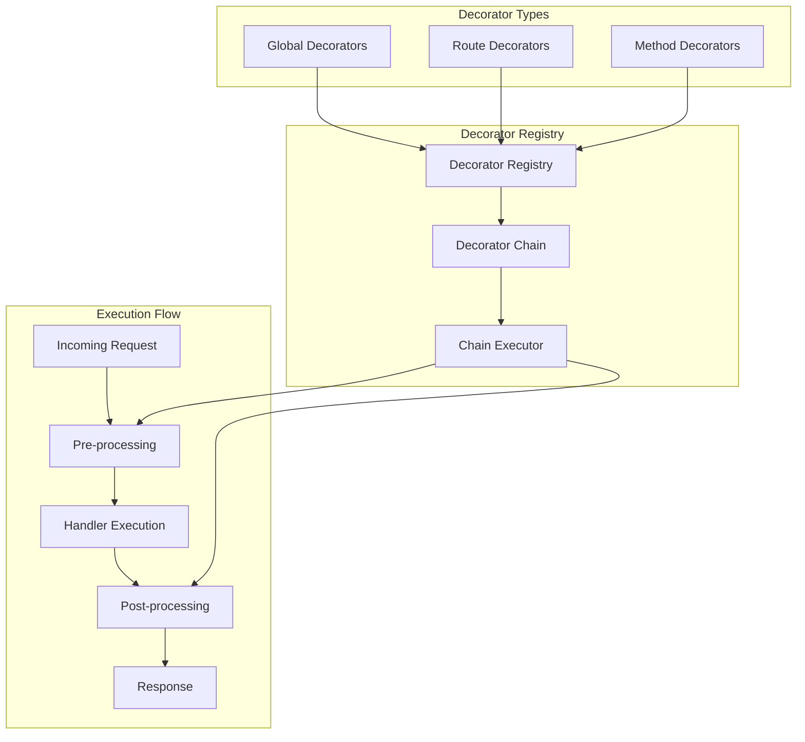
```mermaid
graph TB
    subgraph "Decorator Types"
        Global[Global Decorators]
        Route[Route Decorators]
        Method[Method Decorators]
    end

    subgraph "Decorator Registry"
        Registry[Decorator Registry]
        Chain[Decorator Chain]
        Executor[Chain Executor]
    end

    subgraph "Execution Flow"
        Request[Incoming Request]
        PreProcess[Pre-processing]
        Handler[Handler Execution]
        PostProcess[Post-processing]
        Response[Response]
    end

    Global --> Registry
    Route --> Registry
    Method --> Registry

    Registry --> Chain
    Chain --> Executor

    Request --> PreProcess
    PreProcess --> Handler
    Handler --> PostProcess
    PostProcess --> Response

    Executor --> PreProcess
    Executor --> PostProcess
```

### 8. Enhanced Router Architecture

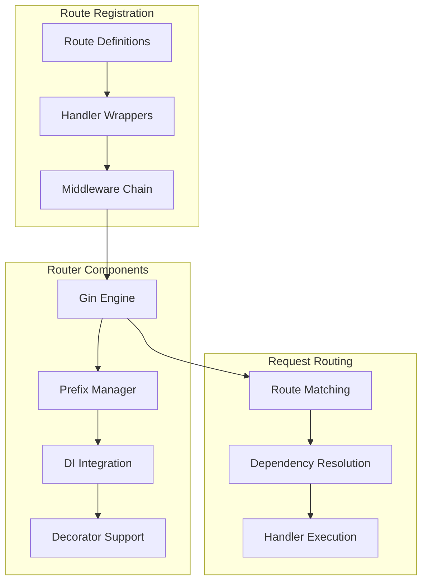
```mermaid
graph TB
    subgraph "Router Components"
        Engine[Gin Engine]
        Prefix[Prefix Manager]
        DI[DI Integration]
        Decorators[Decorator Support]
    end

    subgraph "Route Registration"
        Routes[Route Definitions]
        Handlers[Handler Wrappers]
        Middleware[Middleware Chain]
    end

    subgraph "Request Routing"
        Match[Route Matching]
        Resolution[Dependency Resolution]
        Execution[Handler Execution]
    end

    Engine --> Prefix
    Prefix --> DI
    DI --> Decorators

    Routes --> Handlers
    Handlers --> Middleware
    Middleware --> Engine

    Engine --> Match
    Match --> Resolution
    Resolution --> Execution
```

### 9. Configuration Architecture

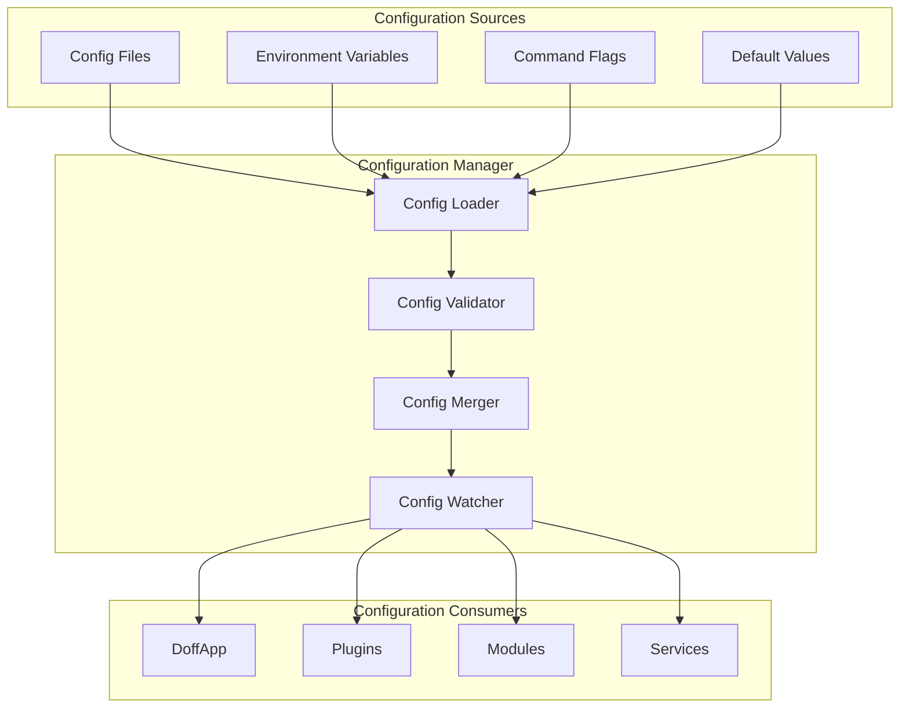
```mermaid
graph TB
    subgraph "Configuration Sources"
        Files[Config Files]
        Env[Environment Variables]
        Flags[Command Flags]
        Defaults[Default Values]
    end

    subgraph "Configuration Manager"
        Loader[Config Loader]
        Validator[Config Validator]
        Merger[Config Merger]
        Watcher[Config Watcher]
    end

    subgraph "Configuration Consumers"
        App[DoffApp]
        Plugins[Plugins]
        Modules[Modules]
        Services[Services]
    end

    Files --> Loader
    Env --> Loader
    Flags --> Loader
    Defaults --> Loader

    Loader --> Validator
    Validator --> Merger
    Merger --> Watcher

    Watcher --> App
    Watcher --> Plugins
    Watcher --> Modules
    Watcher --> Services
```

### 10. Error Handling Architecture

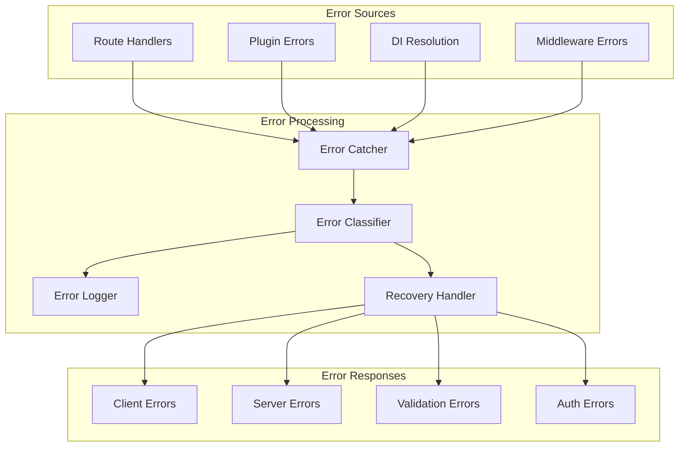
```mermaid
graph TB
    subgraph "Error Sources"
        Handlers[Route Handlers]
        Plugins[Plugin Errors]
        DI[DI Resolution]
        Middleware[Middleware Errors]
    end

    subgraph "Error Processing"
        Catcher[Error Catcher]
        Classifier[Error Classifier]
        Logger[Error Logger]
        Recovery[Recovery Handler]
    end

    subgraph "Error Responses"
        Client[Client Errors]
        Server[Server Errors]
        Validation[Validation Errors]
        Auth[Auth Errors]
    end

    Handlers --> Catcher
    Plugins --> Catcher
    DI --> Catcher
    Middleware --> Catcher

    Catcher --> Classifier
    Classifier --> Logger
    Classifier --> Recovery

    Recovery --> Client
    Recovery --> Server
    Recovery --> Validation
    Recovery --> Auth
```

## Data Flow Architecture

### 1. Service Resolution Flow

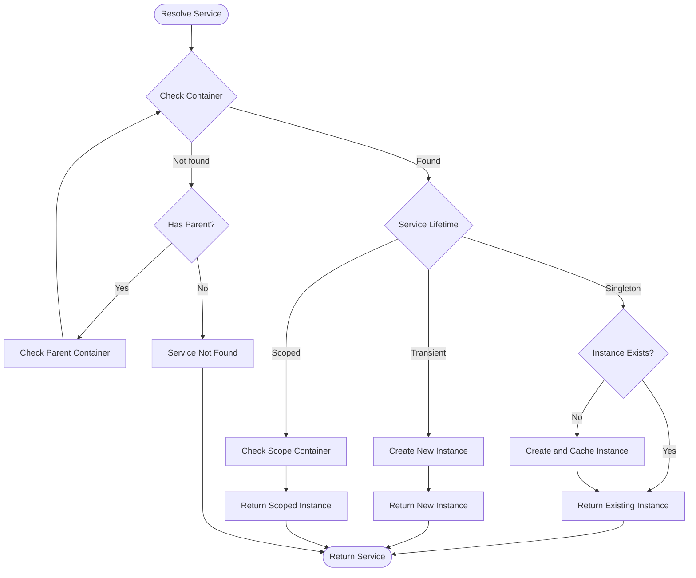
```mermaid
flowchart TD
    Start([Resolve Service]) --> Check{Check Container}
    Check -->|Not found| Parent{Has Parent?}
    Parent -->|Yes| CheckParent[Check Parent Container]
    Parent -->|No| Error[Service Not Found]

    Check -->|Found| Lifetime{Service Lifetime}
    Lifetime -->|Singleton| CheckInstance{Instance Exists?}
    Lifetime -->|Transient| CreateNew[Create New Instance]
    Lifetime -->|Scoped| CheckScope[Check Scope Container]

    CheckInstance -->|Yes| ReturnInstance[Return Existing Instance]
    CheckInstance -->|No| CreateSingleton[Create and Cache Instance]

    CreateNew --> ReturnNew[Return New Instance]
    CheckScope --> ReturnScope[Return Scoped Instance]
    CreateSingleton --> ReturnInstance
    CheckParent --> Check

    ReturnInstance --> End([Return Service])
    ReturnNew --> End
    ReturnScope --> End
    Error --> End
```

### 2. Plugin Dependency Resolution

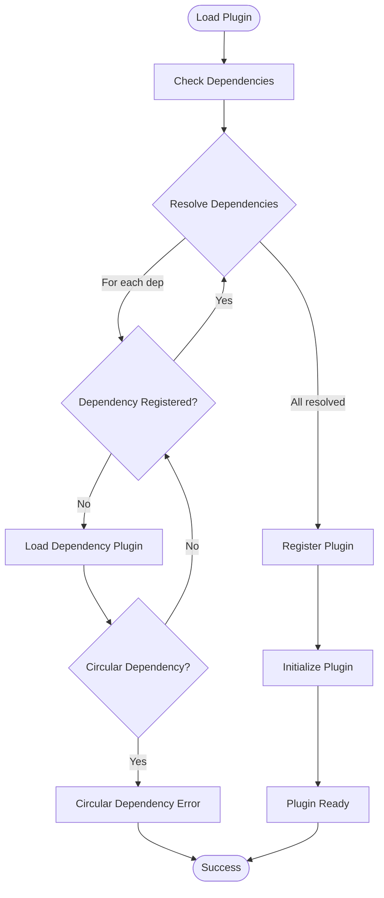
```mermaid
flowchart TD
    Start([Load Plugin]) --> CheckDeps[Check Dependencies]
    CheckDeps --> ResolveLoop{Resolve Dependencies}

    ResolveLoop -->|For each dep| DepRegistered{Dependency Registered?}
    DepRegistered -->|No| LoadDep[Load Dependency Plugin]
    LoadDep --> CheckCircular{Circular Dependency?}
    CheckCircular -->|Yes| Error[Circular Dependency Error]
    CheckCircular -->|No| DepRegistered

    ResolveLoop -->|All resolved| RegisterPlugin[Register Plugin]

    RegisterPlugin --> InitPlugin[Initialize Plugin]
    InitPlugin --> PluginReady[Plugin Ready]

    Error --> End([Failed])
    DepRegistered -->|Yes| ResolveLoop
    PluginReady --> End([Success])
```

## Performance Architecture

### 1. Caching Strategy

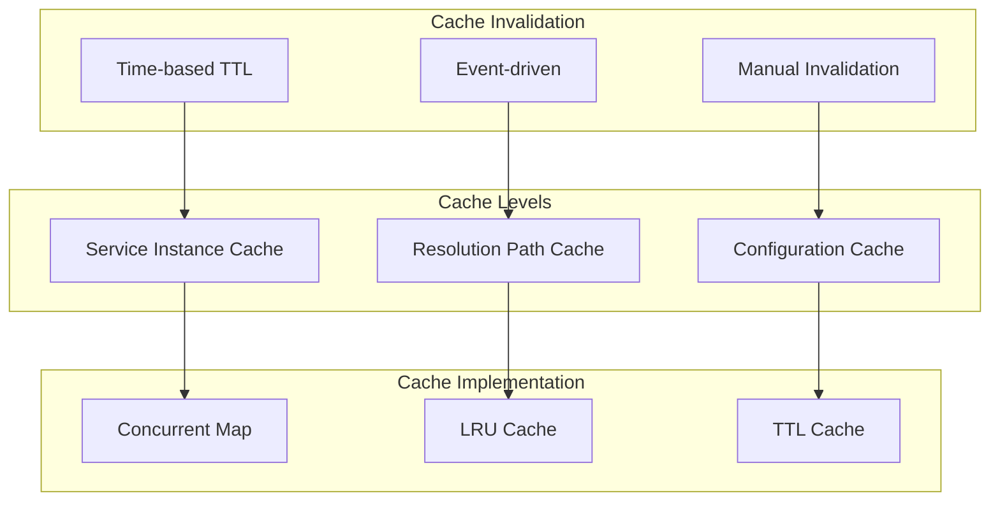
```mermaid
graph TB
    subgraph "Cache Levels"
        L1[Service Instance Cache]
        L2[Resolution Path Cache]
        L3[Configuration Cache]
    end

    subgraph "Cache Invalidation"
        TTL[Time-based TTL]
        Events[Event-driven]
        Manual[Manual Invalidation]
    end

    subgraph "Cache Implementation"
        Map[Concurrent Map]
        LRU[LRU Cache]
        TTLCache[TTL Cache]
    end

    L1 --> Map
    L2 --> LRU
    L3 --> TTLCache

    TTL --> L1
    Events --> L2
    Manual --> L3
```

### 2. Request Optimization

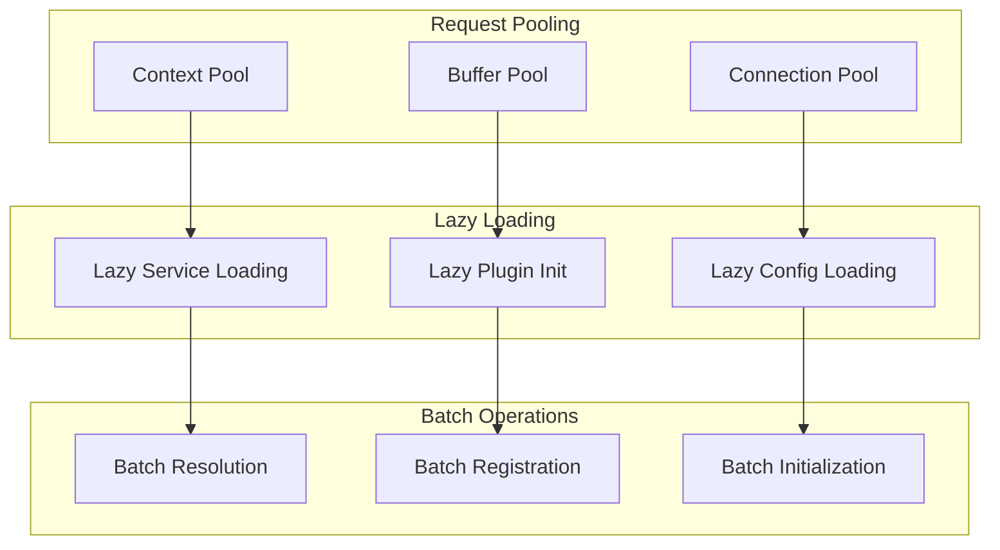
```mermaid
graph TB
    subgraph "Request Pooling"
        ContextPool[Context Pool]
        BufferPool[Buffer Pool]
        ConnPool[Connection Pool]
    end

    subgraph "Lazy Loading"
        ServiceLazy[Lazy Service Loading]
        PluginLazy[Lazy Plugin Init]
        ConfigLazy[Lazy Config Loading]
    end

    subgraph "Batch Operations"
        BatchResolve[Batch Resolution]
        BatchRegister[Batch Registration]
        BatchInit[Batch Initialization]
    end

    ContextPool --> ServiceLazy
    BufferPool --> PluginLazy
    ConnPool --> ConfigLazy

    ServiceLazy --> BatchResolve
    PluginLazy --> BatchRegister
    ConfigLazy --> BatchInit
```

## Security Architecture

### 1. Authentication & Authorization Flow

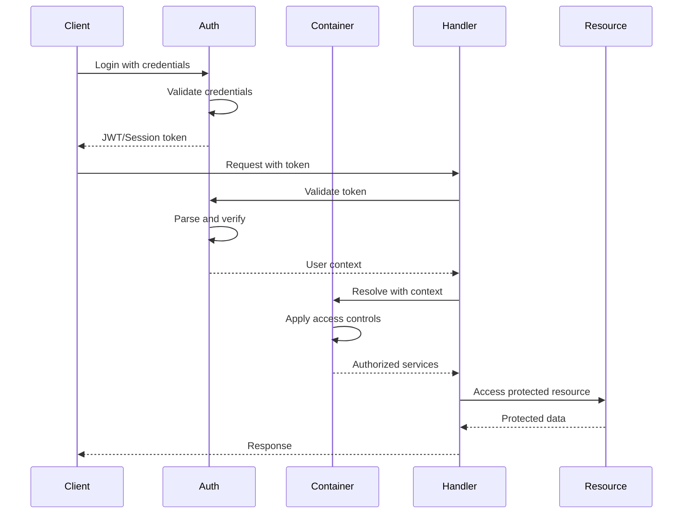
```mermaid
sequenceDiagram
    participant Client
    participant Auth
    participant Container
    participant Handler
    participant Resource

    Client->>Auth: Login with credentials
    Auth->>Auth: Validate credentials
    Auth-->>Client: JWT/Session token

    Client->>Handler: Request with token
    Handler->>Auth: Validate token
    Auth->>Auth: Parse and verify
    Auth-->>Handler: User context

    Handler->>Container: Resolve with context
    Container->>Container: Apply access controls
    Container-->>Handler: Authorized services

    Handler->>Resource: Access protected resource
    Resource-->>Handler: Protected data
    Handler-->>Client: Response
```

### 2. Module Security Boundaries

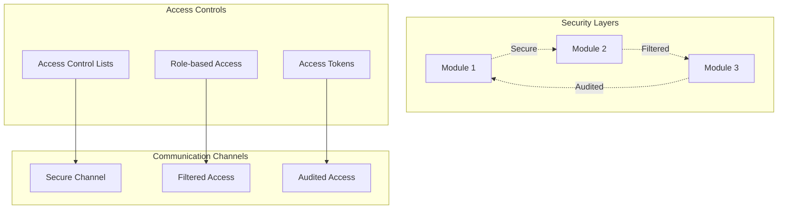
```mermaid
graph TB
    subgraph "Security Layers"
        Module1[Module 1]
        Module2[Module 2]
        Module3[Module 3]
    end

    subgraph "Access Controls"
        ACL[Access Control Lists]
        RBAC[Role-based Access]
        Tokens[Access Tokens]
    end

    subgraph "Communication Channels"
        Secure[Secure Channel]
        Filtered[Filtered Access]
        Audited[Audited Access]
    end

    Module1 -.->|Secure| Module2
    Module2 -.->|Filtered| Module3
    Module3 -.->|Audited| Module1

    ACL --> Secure
    RBAC --> Filtered
    Tokens --> Audited
```

## Deployment Architecture

### 1. Container Deployment

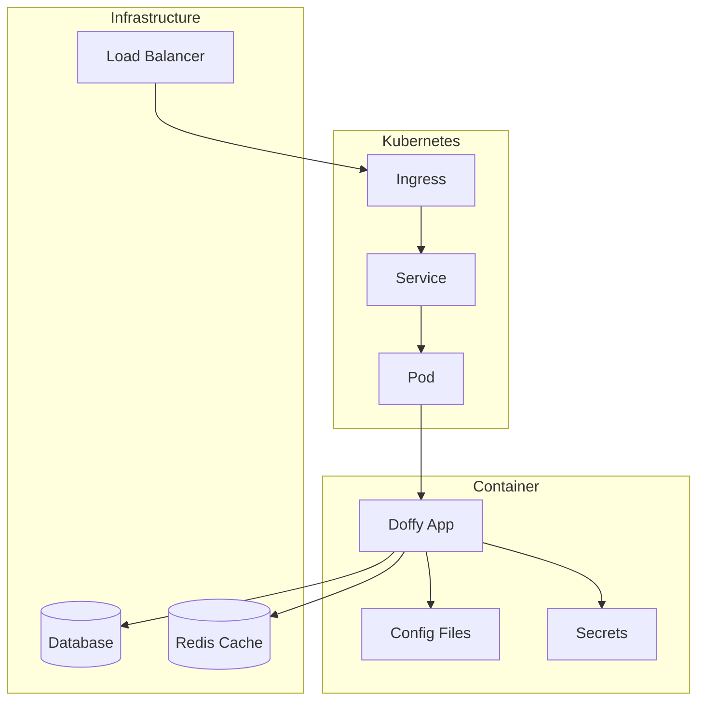
```mermaid
graph TB
    subgraph "Container"
        App[Doffy App]
        Config[Config Files]
        Secrets[Secrets]
    end

    subgraph "Kubernetes"
        Pod[Pod]
        Service[Service]
        Ingress[Ingress]
    end

    subgraph "Infrastructure"
        LoadBalancer[Load Balancer]
        Database[(Database)]
        Cache[(Redis Cache)]
    end

    App --> Config
    App --> Secrets

    Pod --> App
    Service --> Pod
    Ingress --> Service

    LoadBalancer --> Ingress
    App --> Database
    App --> Cache
```

### 2. Scaling Architecture

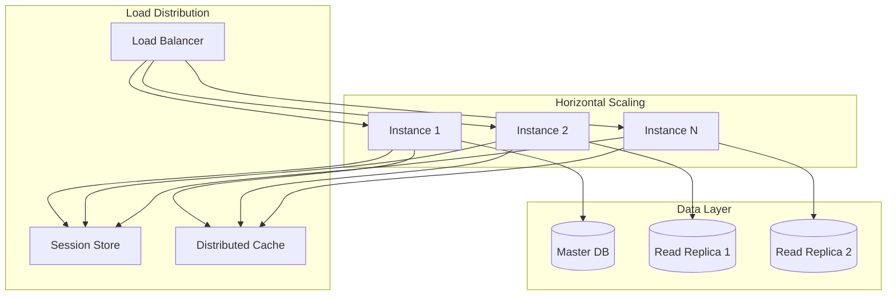
```mermaid
graph TB
    subgraph "Horizontal Scaling"
        Instance1[Instance 1]
        Instance2[Instance 2]
        Instance3[Instance N]
    end

    subgraph "Load Distribution"
        LB[Load Balancer]
        Session[Session Store]
        Cache[Distributed Cache]
    end

    subgraph "Data Layer"
        Master[(Master DB)]
        Slave1[(Read Replica 1)]
        Slave2[(Read Replica 2)]
    end

    LB --> Instance1
    LB --> Instance2
    LB --> Instance3

    Instance1 --> Session
    Instance2 --> Session
    Instance3 --> Session

    Instance1 --> Cache
    Instance2 --> Cache
    Instance3 --> Cache

    Instance1 --> Master
    Instance2 --> Slave1
    Instance3 --> Slave2
```

## Monitoring & Observability

### 1. Observability Stack

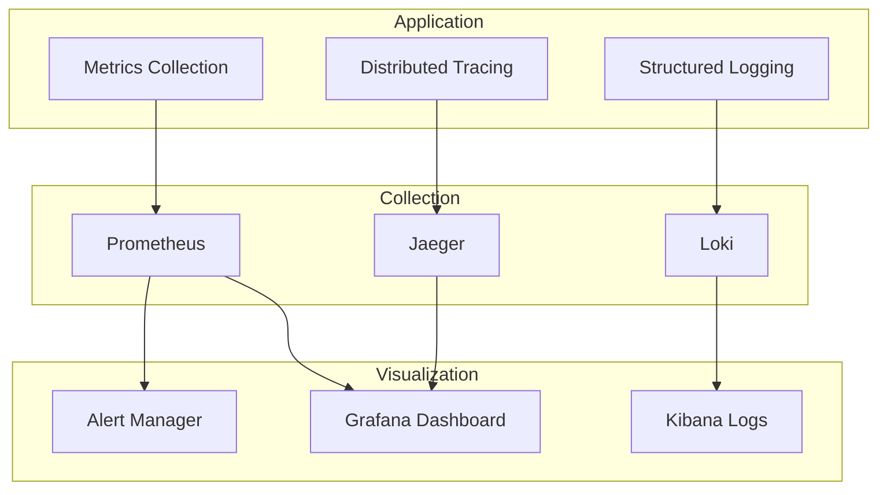
```mermaid
graph TB
    subgraph "Application"
        Metrics[Metrics Collection]
        Tracing[Distributed Tracing]
        Logging[Structured Logging]
    end

    subgraph "Collection"
        Prometheus[Prometheus]
        Jaeger[Jaeger]
        Loki[Loki]
    end

    subgraph "Visualization"
        Grafana[Grafana Dashboard]
        Kibana[Kibana Logs]
        Alerting[Alert Manager]
    end

    Metrics --> Prometheus
    Tracing --> Jaeger
    Logging --> Loki

    Prometheus --> Grafana
    Jaeger --> Grafana
    Loki --> Kibana

    Prometheus --> Alerting
```

---

*Document Version: 1.0.0*
*Last Updated: 2025-12-07*
*Architecture Version: Current as of v1.0.0*